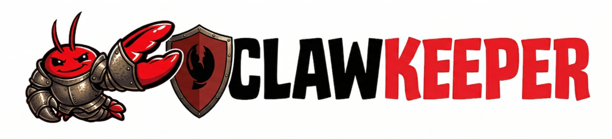
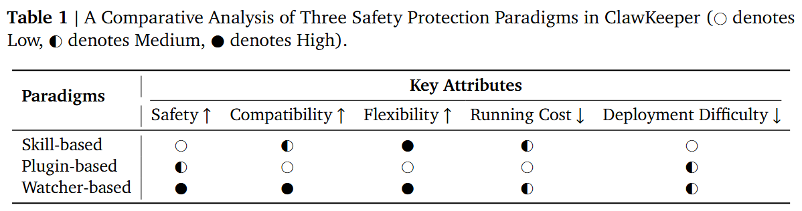
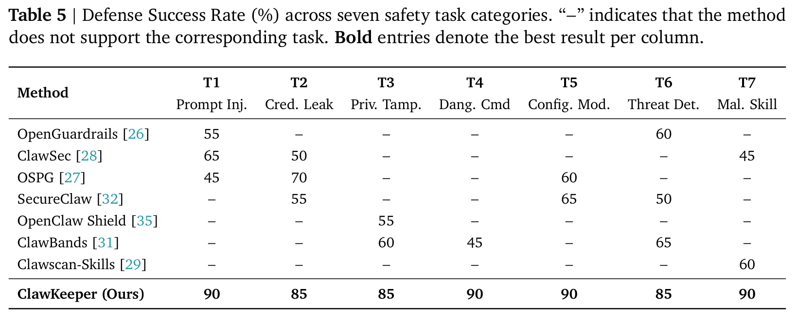

# 🦞🛡️ ClawGuard: Comprehensive Safety Protection for OpenClaw Agents Through Skills and Plugins

<h1 align="center"><i>(aka The Norton for OpenClaw)</i></h1>

<p align="center">
    
</p>

<p align="center">
  <strong>SAFETY EXFOLIATE! SAFETY EXFOLIATE!</strong>
</p>

<p align="center">
  <a href="https://github.com/openclaw/openclaw">
    
  </a>
  <a href="https://opensource.org/licenses/MIT">
    
  </a>
</p>

**ClawGuard** is a _comprehensive real-time security framework_ designed for autonomous agent systems such as **OpenClaw**. It provides unified protection through two complementary approaches: **skill-based** safeguards at the instruction level and **plugin-based** enforcement at the runtime level.

# 🔎 Overview

**ClawGuard** provides protection mechanisms across two complementary architectural layers:

- **Skill-based Protection** operates at the instruction level, injecting structured security policies directly into the agent context to enforce environment-specific constraints and cross-platform boundaries.

- **Plugin-based Protection** serves as an internal runtime enforcer, providing configuration hardening, proactive threat detection, and continuous behavioral monitoring throughout the execution pipeline.

Together, they form a defense-in-depth security architecture covering the full agent lifecycle — from instruction interpretation to runtime execution.


# 📦 Installation

ClawGuard supports two complementary protection mechanisms.

## 📚 I. [Skill-based Protection](ClawGuard-skill/README.md)

Inject security policies directly into the agent context through structured Markdown documents and scripts.

**Quick Start:**

### Windows Safety Guide
```powershell
cd ClawGuard-skill/skills/windows-safety-guide
./scripts/install.ps1
```

Then instruct OpenClaw:
```
Please use the windows-safety-guide skill to enforce behavior security policies, configuration protection, and enable nightly security audits.
```

### Feishu (Lark) Safety Guide
```bash
cd ClawGuard-skill/skills/feishu-safety-guide
bash scripts/install.sh
```

Then instruct OpenClaw:
```
Please use the feishu-safety-guide skill to enforce message protection, credential security, and enable periodic security reporting in Feishu (Lark).
```

For **detailed** setup options and deployment from prompt, see [Skill-based Protection](ClawGuard-skill/README.md).

---

## 📚 II. [Plugin-based Protection](ClawGuard-plugin/README.md)

A runtime enforcer plugin providing configuration auditing, threat detection, and behavioral monitoring.

**Quick Start:**

### Linux/macOS
```bash
cd ClawGuard-plugin
bash install.sh
```

### Windows
```powershell
cd ClawGuard-plugin
./install.ps1
```

Then verify installation:
```bash
npx openclaw ClawGuard audit
```

For **detailed** command reference and advanced usage, see [Plugin-based Protection](ClawGuard-plugin/README.md).

---

# 💡 Features


- **Comprehensive Security Scanning:** Regularly scans the runtime environment, dependencies, and workspace for vulnerabilities, providing clear and actionable risk alerts before threats occur.

- **Real-time Threat Prevention & Gating:** Evaluates AI actions in real time, blocking high-risk behaviors such as prompt injection, credential leakage, and code injection.

- **Behavioral Profiling & Anomaly Detection:** Builds long-term behavioral baselines for AI agents and detects anomalies when unusual actions, risky tool calls, or dangerous commands appear.

- **Intent Enforcement & Trajectory Analysis:** Monitors multi-turn interactions to ensure AI actions stay aligned with the user's original intent and prevents goal drift, unsafe loops, or unauthorized actions.

- **Config Integrity & Drift Monitoring:** Protects critical configuration files and alerts users when unexpected changes weaken security settings or introduce new risks.

- **Automated Hardening & Remediation:** Provides vulnerability remediation suggestions, applies secure default configurations, and supports one-click rollback with automatic backups.

- **Third-Party Extension Shield:** Reviews and monitors external extensions and plugins to prevent malicious behavior or excessive permission access.

- **Comprehensive Logging & Auditing:** Maintains full logs of user inputs, AI outputs, tool usage, and security decisions for auditing, compliance, and traceability.

- **Self-Evolving Threat Intelligence:** Stores high-risk events and decisions to build a threat intelligence library that helps detect and prevent recurring or new attack patterns.

- **Cross-Platform Ecosystem Security:** Ensures consistent security protection across operating systems and third-party platforms, providing full ecosystem coverage.

---

# 🔬 Comparative Analysis of Safety Paradigms in ClawGuard

ClawGuard offers comprehensive security mechanisms across two complementary layers, allowing users to freely select and combine them according to their specific requirements, whether prioritizing runtime efficiency or security performance.



# 📈 Experiment Results

To systematically assess the security capabilities of ClawGuard, we construct a benchmark comprising seven categories of safety tasks, each containing 20 adversarial instances divided equally into 10 simple and 10 complex examples. We compare ClawGuard against the most prominent open-source security repositories for OpenClaw-style agent ecosystems.
The results showed that ClawGuard achieved optimal defense performance.



---

# 🔥 Updates
- [2026-04-07] 🛡️ ClawGuard v1.1 — new guard pipeline & security hardening:
  - **Execution Gate (`exec-gate`)**: Regex-based dangerous command detector that blocks destructive shell commands (e.g., `rm -rf /`, fork bombs, `curl | sh`, disk wipes) before agent execution.
  - **Path Guard (`path-guard`)**: Protected path enforcement that prevents agents from reading, writing, or deleting sensitive files (e.g., `~/.ssh/**`, `~/.aws/credentials`, `/etc/shadow`).
  - **Input Validator (`input-validator`)**: Lightweight JSON-Schema-subset validator that rejects malformed tool inputs (missing fields, wrong types, oversize strings, NUL bytes) at the interface boundary.
  - **Budget Guard (`budget-guard`)**: Rolling-window token budget control that halts agent execution when configured input/output/total token limits are exceeded.
  - **Permission Store (`permission-store`)**: Persistent allow/deny decisions keyed by (tool, fingerprint) with session and forever scopes, enabling operator-controlled authorization.
  - **CLI interface (`cli.js`)**: New `openclaw ClawGuard permission` commands for managing allow/deny rules from the command line.
  - **Tool schemas**: Added structured schemas for `bash`, `read_file`, and `write_file` tools.
  - **Security hardening**: Fail-closed policy enforcement, scoped permission bypass (allow no longer skips budget-guard and input-validator), and HMAC-SHA256 integrity protection for permission store files.
- [2026-03-25] 🎉 ClawGuard v1.0 has been released.
- [2026-03-26] 🧠 We released our [paper](https://arxiv.org/abs/2603.24414)

---

# 📝 License

This project is licensed under [MIT](https://opensource.org/licenses/MIT).